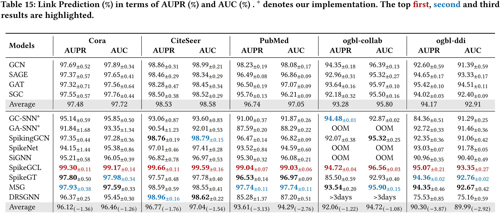
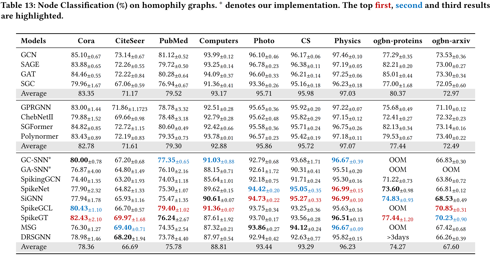
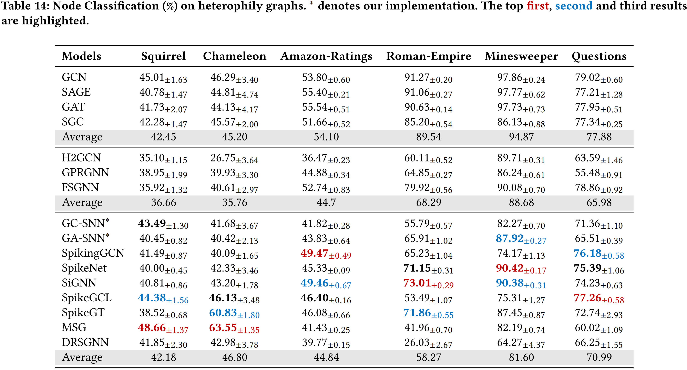

# SGNNBench

## Link Prediction

## Node Classification on Homophily datasets

## Node Classification on Heterophily datasets

## Methods
The following exemplary SGNNs have been implemented:

|Method|Paper|Pytorch|PyG|
|-|-|-|-|
|GC-SNN|\[2021, IJCAI\] Exploiting spiking dynamics with spatial-temporal feature normalization in graph learning|✅|✅|
|GA-SNN|\[2021, IJCAI\] Exploiting spiking dynamics with spatial-temporal feature normalization in graph learning|✅|✅|
|SpikingGCN|\[2022, IJCAI\] Spiking Graph Convolutional Networks|✅|✅|
|SpikeNet|\[2023, AAAI\] Scaling up dynamic graph representation learning via spiking neural networks|✅|✅|
|SpikeGCL|\[2024, ICLR\] A graph is worth 1-bit spikes: When graph contrastive learning meets spiking neural networks|✅|✅|
|SpikeGT|\[2024, arXiv\] SpikeGraphormer A High-Performance Graph Transformer with Spiking Graph Attention|✅|✅|
|MSG|\[2024, NIPS\] Spiking Graph Neural Network on Riemannian Manifolds|✅|✅|
|DRSGNN|\[2024, AAAI\] Dynamic Reactive Spiking Graph Neural Network|✅|✅|
|SiGNN|\[2025, Pattern Recognition\] SiGNN: A spike-induced graph neural network for dynamic graph representation learning|✅|✅|

## Contact
To ask questions or report issues, please open an issue on the [issues tracker](https://github.com/Zhhuizhe/SGNNBenchmark/issues).
